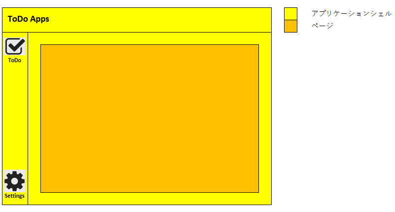

# Angular Labo

このリポジトリはhashiohiro個人のAngularに関する学習の記録です。

## 1. Angular 開発環境の構築

### 1.1. 前提

    - 実施するコマンドは特段の指定がない限り、ローカルリポジトリのルートフォルダ上で行うものとする。
    - バージョン管理ツールの利用について本手順では割愛する。

### 1.2. 開発環境の構築手順

1. Node.jsのインストール確認

    インストール済みか確認はコマンドプロンプトで以下のコマンドを実行して行う。

    `node --version`

    ※ コマンドを認識しない場合は、Node.jsのインストールを行うこと。

2. @angular/cliのインストール

    以下のコマンドで@angular/cliをインストールする。

    `npm install -g @angular/cli`

    ※ @angular/cliはAngularアプリケーションの開発に必要な機能をもつコマンドラインツール。主要機能は以下の通り。
    
    - Angularプロジェクトの作成
    - Angular要素作成のためのスニペット
    - 開発サーバ
    - ビルド&デプロイ
    - 自動テスト実行

3. 統合開発環境のインストール(IDE)

    以下のリンクより、Visual Studio Codeの最新版を取得、インストールする。

    [https://code.visualstudio.com/](https://code.visualstudio.com/)

## 2. Angularアプリケーションの作成

### 2.1. Angularプロジェクトの作成

以下のコマンドでAngularプロジェクトを作成する。

`ng new <Angularプロジェクト名>`

コマンドを実行後の対話では以下のように回答する。

#### 対話の回答

1. このプロジェクトに関する仮名の使用状況データを Angular チームと共有しますか?

    → N

2. どのスタイルシート形式を使用しますか?

     → 使用するものを選択する。

    - CSS
    - SCSS (オススメ)
    - Sass
    - Less

3. サーバーサイド レンダリング (SSR) と静的サイト生成 (SSG/プリレンダリング) を有効にしますか?

    → N

## 3. Angularプロジェクトのビルドと実行

### 3.1. Angular流のやり方 (ビルド & 実行 & 開く...合体技！)

1. 以下のコマンドで一発！

    `ng serve --open`

    #### ng serve できること

    - アプリケーションをビルドする
    - 開発用サーバーを起動する
    - ソースファイルを監視する
    - 変更に応じてアプリケーションを再ビルドする

### 3.2. Angular以外でよく知られたやり方 (工程が多く手間)

1. Angularプロジェクトのビルド

    以下のコマンドでビルドする。

    `npm run watch`

    - 「npm run build」でもできるが、ファイル保存時に自動でビルドしてくれる便利なヤツ。

2. Angularプロジェクトの実行

    以下のコマンドで実行する。

    `npm run start`

    - ビルドしてできあがったAngularアプリケーションを開発サーバで実行できる。
    - URLは [http://localhost:4200/](http://localhost:4200/)

## 4. これからの進め方

- ng newでアプリケーションシェルが自動生成された。
    - アプリケーションシェル : app.component.(html|scss|ts)
    - アプリケーションシェルとはページ間共通の、ページごとに再ロードする必要がない部分。    (ex.ビゲーションバー、サイドバー、フッターなど)

- これからToDoアプリケーションを作る。
    - デザインガイドラインは「Material UI」を採用する。(Angular Materialというパッケージを使用)
    - バックエンドは、Restful APIなモックを用意して使う。(json-serverというパッケージを使用)
    - 実装する部分は大きく2つ。
        1. アプリケーションシェルの実装
            
            → 「x. アプリケーションシェルの実装」を参照する。

        2. ページの実装

            →「x. ページの実装」を参照する。

    - 実装部分イメージ

        

## 5. アプリケーションシェルの実装

### 5.1 アプリケーションシェルの構成要素の作成

## 参考
[参考 : はじめてのAngularアプリケーションを作ろう](https://angular.jp/tutorial/first-app)